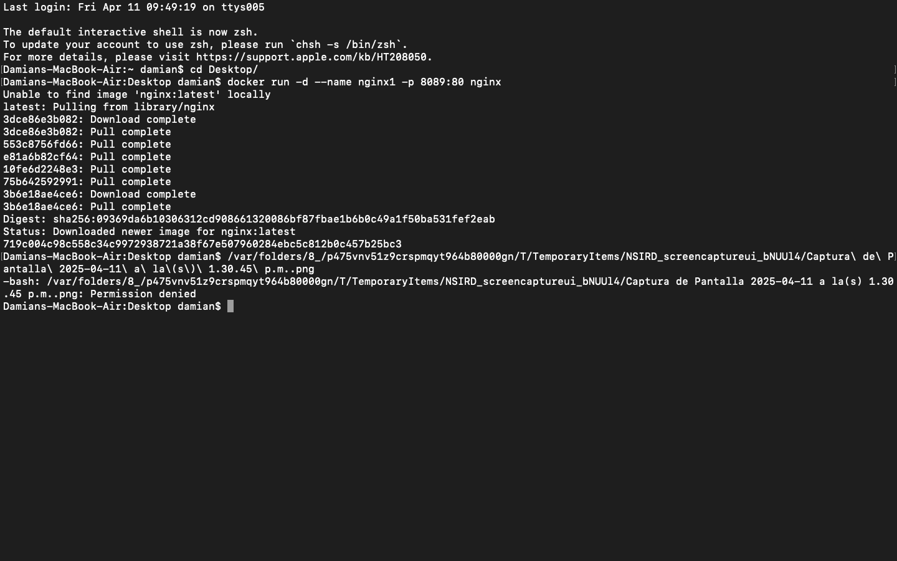
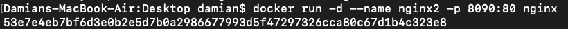
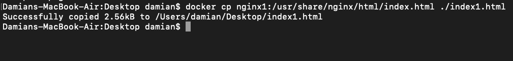
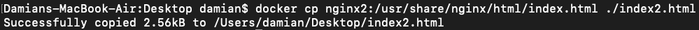
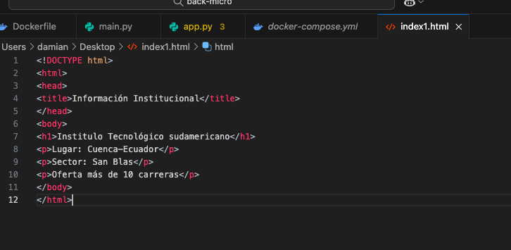
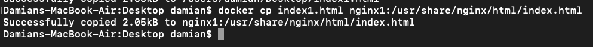
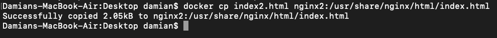
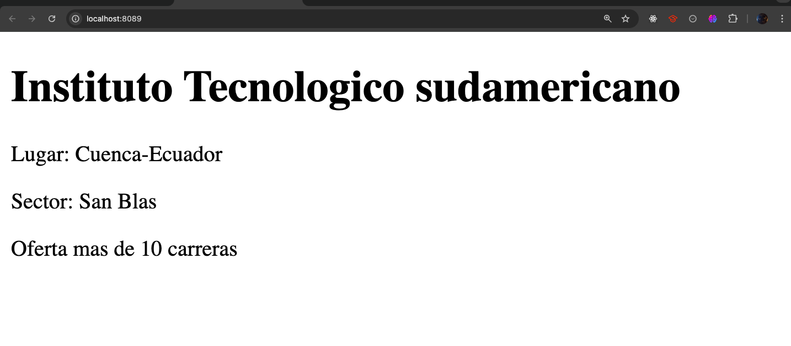
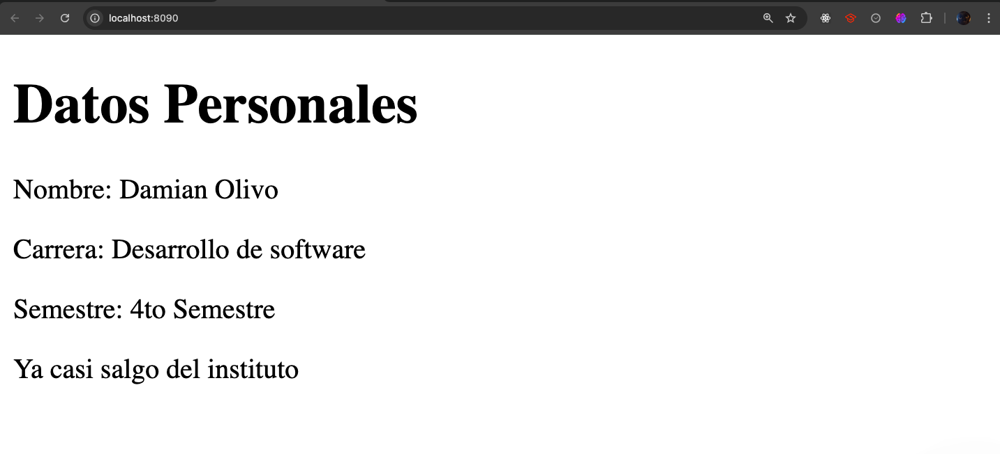

# Informe Práctica: Despliegue de servidores web Nginx

By: Damian Olivo

## 1. Título  
**Despliegue de dos servidores web Nginx con Docker**

## 2. Tiempo de duración  
15 minutos para completar toda la práctica.

## 3. Fundamentos  
Nginx en si es un servidor web de un rendimiento alto. En esta práctica:  
- Usamos contenedores Docker para desplegar dos instancias de Nginx. 
- nginx1: Muestra información institucional  
- nginx2: Contiene información personal del estudiante  
- Docker nos permite crear entornos aislados con todo lo necesario para ejecutar cualquier aplicación  

## 4. Conocimientos previos  
Requeridos:  
- Conceptos básicos de servidores web  
- Comandos básicos de Docker     

## 5. Objetivos a alcanzar    
- Desplegar 2 servidores Nginx en contenedores Docker independientes  
- Personalizar contenido de cada servidor  
- Entender mapeo de puertos en Docker  
- Manejar archivos entre host y contenedores  

## 6. Equipo necesario  
- Docker instalado   
- Editor de texto en este caso usé VS Code 

## 7. Material de apoyo   
- [Documentación Nginx](https://nginx.org/en/docs/)  
- [Documentación Docker](https://docs.docker.com/)    

## 8. Procedimiento  

### Paso 1: Crear contenedores

Con estos comandos creo los contenedores cada uno en puertos independentes.

```
docker run -d --name nginx1 -p 8089:80 nginx

docker run -d --name nginx2 -p 8090:80 nginx
```
<p align="center">
  
</p>

<p align="center">
  
</p>

### Paso 2: Personalizar contenido

Estos sirven para cambiar archivos originales al host

```
docker cp nginx1:/usr/share/nginx/html/index.html ./index1.html

docker cp nginx2:/usr/share/nginx/html/index.html ./index2.html
```
<p align="center">
  
</p>

<p align="center">
  
</p>

Editamos el contenido en este caso en VS code

<p align="center">
  
</p>

### Paso 3: Devolver archivos editados

Este comando hay que usarlo siempre haga un cambio y quiera que se actualice.

```
docker cp index1.html nginx1:/usr/share/nginx/html/index.html

docker cp index2.html nginx2:/usr/share/nginx/html/index.html
```
<p align="center">
  
</p>

<p align="center">
  
</p>

### Paso 4: Localhost
En el navegador en estos localhost podremos vizualizar los html:

http://localhost:8089 (institucional)

http://localhost:8090 (personal)


### 9. Resultados 

2 servidores Nginx independientes
<p align="center">
  
</p>

<p align="center">
  
</p>

### 10. Bibliografía

Nginx Documentation Team. (2023). NGINX Official Documentation. https://nginx.org/en/docs/

Docker Inc. (2023). Docker Documentation. https://docs.docker.com/