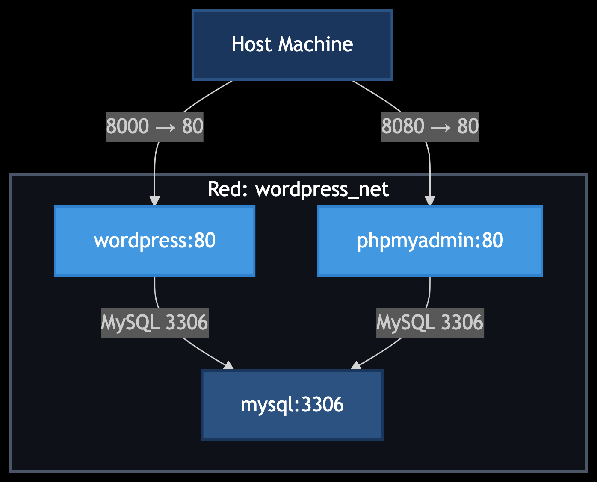

# TAS5 - Wordpres con docker

## 1. Título  
Guía Paso a Paso para Crear un Sitio WordPress con Docker.

## 2. Tiempo de duración  
Aproximadamente 45 minutos para completar toda la práctica.

## 3. Fundamentos  

Docker es una plataforma que permite crear, desplegar y gestionar aplicaciones en contenedores. En esta práctica, se configurarán tres contenedores:  
- **MySQL**: Servidor de base de datos relacional.  
- **phpMyAdmin**: Interfaz gráfica para administrar MySQL.  
- **WordPress**: Plataforma para la creación de sitios web.  

La conexión entre los contenedores se realizará mediante una red personalizada en Docker, lo que garantiza comunicación aislada y segura. Esto es fundamental para entornos de desarrollo.

## 4. Conocimientos previos  

Para realizar esta práctica fue necesario manejar:  
- Comandos básicos de Docker (`run`, `network`, `volume`).  
- Conceptos de redes y volúmenes en Docker.  
- Configuración de variables de entorno en contenedores.  
- Navegación por terminal.  

## 5. Objetivos a alcanzar  

- Crear y conectar contenedores Docker para MySQL, phpMyAdmin y WordPress.  
- Configurar una red personalizada y volúmenes en Docker.  
- Verificar la conexión y funcionalidad del sitio WordPress.  

## 6. Equipo necesario  

- Computador con Docker instalado (en este caso, macOS).  
- Terminal de comandos Zsh.  

## 7. Material de apoyo  

- Documentación oficial de Docker: https://docs.docker.com/  
- Manual de MySQL: https://dev.mysql.com/doc/  
- Documentación de WordPress: https://wordpress.org/support/  

## 8. Procedimiento  

### Paso 1: Crear la red personalizada en Docker  

  

### Paso 2: Crear volúmenes para persistencia de datos  

  

### Paso 3: Configurar el contenedor de MySQL  

  

### Paso 4: Configurar el contenedor de phpMyAdmin  

  

### Paso 5: Configurar el contenedor de WordPress  

  

### Paso 6: Verificar contenedores en ejecución  

  

### Paso 7: Acceder a los servicios  

- **WordPress**: [http://localhost:8000](http://localhost:8000)  
- **phpMyAdmin**: [http://localhost:8080](http://localhost:8080)  

## 9. Resultados esperados  

#### Figura 1.1. Contenedores funcionando y conectados  

  

  

#### Figura 1.2. Acceso a phpMyAdmin via localhost:8080  

  

#### Figura 1.3. Sitio WordPress funcionando en localhost:8000  

  

## 10. Diagrama

  

## 11. Bibliografía  
- Docker Documentation. (n.d.). Networking in Docker. https://docs.docker.com/network/  
- MySQL. (n.d.). Official MySQL Docker Image. https://hub.docker.com/_/mysql  
- Documentation. (n.d.). Documentation. https://wordpress.org/documentation/